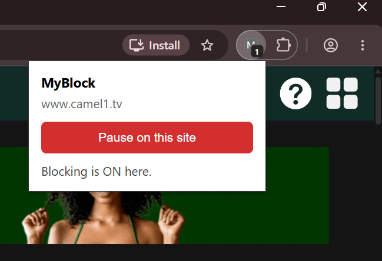

# MyBlock

A lightweight ad blocker browser extension built from scratch as a learning project, modeled on the architecture of uBlock Origin. Works on Chrome, Brave, Edge and Firefox-based browsers (Zen).



## Features

- **Network blocking**: stops requests to ad and tracker domains before they load (Manifest V3 declarativeNetRequest).
- **Cosmetic filtering**: hides leftover empty ad boxes with CSS, with generic and per-site selectors.
- **Per-site pause**: toolbar popup button to turn blocking off on the current site.
- **Blocked counter**: toolbar badge shows how many requests were blocked on the current tab.
- **Filter list converter**: write filters in Adblock Plus syntax and compile them to browser rules with a Node script.

## Install (development)

**Chrome / Brave / Edge**
1. Open chrome://extensions (brave://extensions or edge://extensions).
2. Turn on **Developer mode**.
3. Click **Load unpacked** and select this folder.

**Zen / Firefox**
1. Open about:debugging and click **This Firefox**.
2. Click **Load Temporary Add-on** and select manifest.json.
3. Temporary add-ons are removed when the browser closes, so reload it each session.

## Project structure

```
manifest.json         Extension config: permissions, files, entry points
background.js         Service worker: badge counter, allowlist rules
content.js            Cosmetic filtering, injected into every page
popup/                Toolbar popup (popup.html, popup.js)
rules/rules.json      Compiled network rules (generated, do not hand-edit)
tools/filters.txt     Your filter list (edit this)
tools/convert.js      Compiles filters.txt into rules/rules.json
```

## How it works

1. A page starts loading and requests scripts, images and frames.
2. The browser checks each request against rules/rules.json and blocks matches. The extension never sees your browsing, which is the privacy benefit of Manifest V3.
3. content.js injects CSS that hides known ad containers the network rules couldn't remove.
4. When you pause a site, its hostname is saved to storage and background.js adds an allowAllRequests rule for it. content.js skips hiding there too.

## Development workflow

1. Add a filter to tools/filters.txt, for example: ||adsite.com^
2. Compile the rules:

```
node tools/convert.js
```

3. Click the reload icon on the extension in the extensions page.
4. Refresh the page you are testing.

To add a cosmetic filter, edit the GENERIC or PER_SITE lists at the top of content.js.

## Testing

- **Block test**: on any normal page, open DevTools > Console and run:

```
fetch("https://doubleclick.net/").catch(e => console.log("blocked:", e.message))
```

  A "Failed to fetch" result and a red ERR_BLOCKED_BY_CLIENT line in the Network tab mean the rule works.
- **Cosmetic test**: run this in the Console. The red box should not appear:

```
document.body.insertAdjacentHTML("beforeend", "<div class='ad-banner' style='position:fixed;top:0;left:0;background:red;padding:20px'>TEST AD</div>")
```

- **Pause test**: click the popup button, confirm the page reloads and the box above now appears.
- **Real-world test**: visit a public ad blocker test page and a news site, and watch the badge counter.
- **Debugging**: on chrome://extensions, click the Errors button, or inspect the service worker.

## Supported filter syntax

| Syntax | Meaning |
|---|---|
| ||domain^ | Block a domain and its subdomains |
| ||domain^$third-party | Block only when loaded from another site |
| ! text | Comment |

Unsupported lines are skipped with a warning when you run the converter.

## Known limitations

- Ads served from the same domain as the content (such as YouTube video ads) can't be blocked by domain rules. uBlock Origin uses script injection for these.
- Chrome caps the number of static rules, so a full EasyList must be trimmed.
- Cosmetic filtering is selector-based and can miss ads with random class names.

## Roadmap

- [ ] Support resource-type options ($script, $image, $subdocument)
- [ ] Support exception rules (@@)
- [ ] Compile cosmetic filters (##.class) into content.js automatically
- [ ] Global on/off switch
- [ ] Import real EasyList
- [ ] Options page to edit filters in the browser
- [ ] Extension icons

## Credits

Inspired by [uBlock Origin](https://github.com/gorhill/uBlock). Filter syntax follows the Adblock Plus format.

## License

Add a license of your choice (MIT is a common default for small projects).
